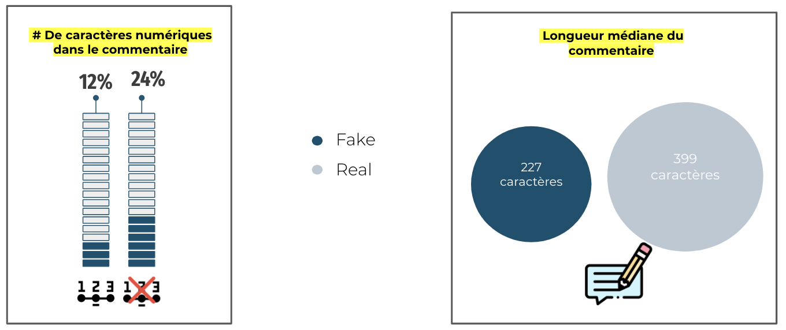
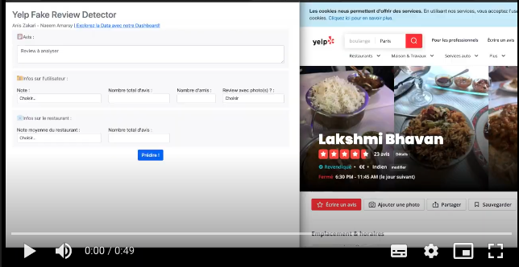
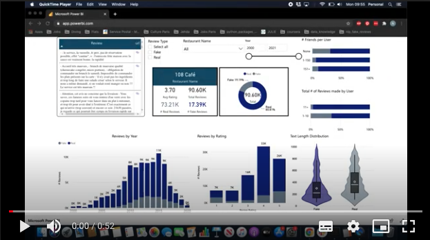

# Fake_reviews_detection - NLP (Natural Language Processing)

## Introduction
In the context of the Jedha Bootcamp Full Stack curriculum,
this was our final project after an intensive 12 week Data Science Bootcamp.
We found this subject interesting as current research has found that around 20% of the reviews on internet are estimated to be fake while online reviews influencing the purchase decisions for 93% of people.

you can find in the following link an article written in french by Jedha Bootcamp about our project
https://www.jedha.co/blog/detecter-faux-avis-reseaux-sociaux

The video of our project presentation in French:
https://youtu.be/UypqiyFgkaw?t=2011

## Objective and Motivations
The project aim's at creating a machine learning algorithm to detect french fake reviews on Yelp.fr.
We wanted to base our study on french reviews as it has hardly been done so far in this language.
Moreover, fake reviews can be devastating for one's business:
* Customers who are misleaded won't trust a marketplace or a review site anymore. 
* Some quality products may be underrated while some low-quality products are being overrated which leads to an unfair competition.  

## Methodology
### What is a Fake review ?
"A fake review is a review written by someone who has not actually used the product or service. They can be written by friends, family, or employees of the company. Fake reviews are also generated by bots and companies who pay individuals to write fraudulent reviews."

### Why Yelp ?
Yelp is the only website we found that displays reviews and categize them publicly in two categories:
* those which are  are estimated to be trushworthy
* those which are not trusted.

"Yelp’s recommendation software is constantly working to highlight the most reliable and helpful reviews. The automated software looks at hundreds of different signals, including various measures of quality, reliability, and user activity on Yelp."
for more information: https://www.yelp-support.com/article/What-is-Yelp-s-recommendation-software?l=en_US

We will consider "Yelp Not Trusted Reviews" as an estimator of Fake reviews

## Project Worflow
.png)

* Scraping Yelp with Selenium
* Cloud storage via Aws
* Dataset and text cleaning
* Feature Engineering (metadata)
* Deal with Imabalanced dataset
* Detection on text only using several ML models
* Detection on metadata only using several ML models
* Detection with mixed data model (text and metadata) with Deep Learning Neural Network 
* Models Evaluation
* Data visualization with a Power BI Dashboard

## Example of Engineered Features

## Models

## Deployment 

### App
]

### Dashboard
]

